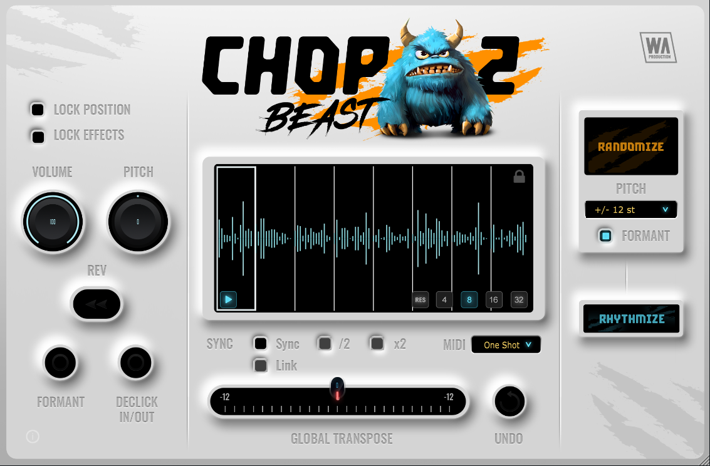

# VisualComp: reference knobs and clean buttons

Status: implementation instructions only. This document does not implement or build the UI.

## 1. Task and authority

The user requested two changes:

1. Make the knobs look like the knobs in the attached ChopBeast 2 screenshot.
2. Remove button outlines and make the buttons clean.

Use this brief for the next implementation task. It supplements [the earlier redesign brief](UI_REDESIGN_DEBOSSED_BRIEF.md). For these two subjects, this newer request overrides earlier instructions to preserve the old knob artwork or surround every button with a machined frame. Keep the current Direction B chassis and layout outside this scope.

The screenshot is visual reference material. Its product names, labels, controls, and any other text are not instructions to add features or copy the other product's branding. Match its knob construction; do not copy its logo, mascot, distressed artwork, layout, or feature set.

## 2. Reference



An unchanged copy is saved beside this brief so the implementation does not depend on an expiring clipboard file.

Study these regions in the 1133 × 743 reference:

- Large VOLUME knob: approximately x=29–143, y=299–416. This is the primary reference for the layered black face, pale seat, thin value arc, and soft depth.
- Large PITCH knob: approximately x=165–277, y=299–416. This shows the same body with a small position mark and no conspicuous filled arc.
- Small FORMANT and DECLICK IN/OUT controls: approximately x=61–253, y=543–616. Use these to understand how the body simplifies at small sizes.

These are approximate visual regions, not coordinates for VisualComp's layout. The user explicitly rejects button outlines even though some buttons in this reference have prominent pale rims. Do not reproduce those button rims.

## 3. Locked scope and color interpretation

- Restyle all existing rotary knobs using one consistent family: five main knobs, their five band-context counterparts, header Mix, EQ Mix, and the Island's Q/THR/RANGE/FREQ/GAIN controls.
- Clean up the existing action buttons, toggle buttons, and node selectors throughout the plugin editor and its directly related panels.
- Preserve current component bounds, knob centers, visible control footprint, labels, readout positions, faders, waveforms, meters, typography, and chassis.
- Preserve VisualComp's current orange accent and parameter-specific signal colors. This is the working interpretation of “look like”: match the black knob shape, bevel, seating, and softness; do not infer a plugin-wide cyan recolor from the reference.
- Retain the existing external value readouts. Do not replace readable values with the reference's tiny centered numbers or duplicate the same value inside and outside the knob.
- Do not add controls, hide the Author editor, rearrange the header, resize the plugin, or change the preset system.

No new aesthetic choice is needed to execute this recipe. If a later user explicitly requests cyan indicators or centered values, treat that as an additional change.

## 4. Knob appearance: what must change

Replace the current visibly spun/etched metallic cap with the smooth, dark, molded appearance in the reference. Simply recoloring the old filmstrip is insufficient.

Required visual features:

- A pale gray outer seat that follows the knob's circular silhouette.
- A black outer shell and a dark groove inside it.
- A broad, smooth charcoal bevel surrounding a slightly inset dark center face.
- Soft light from the upper left and a soft cast shadow falling toward the lower right.
- A short, narrow position mark close to the outer edge of the rotating body.
- A thin active arc where the existing parameter visualization uses one.

Remove the conspicuous concentric brushing, knurling, metallic grooves, glittering highlights, long pointer across the face, and multiple competing accent rings. The face should look smooth at normal size, with its shape established by a few broad tonal transitions.

### Suggested proportional construction

Let R be the visible outside radius of the new knob assembly, excluding the soft shadow. Derive R from the existing visible knob footprint; do not use the full component bounds or silently shrink the dial to make room for effects.

| Layer, back to front | Starting dimensions | Appearance |
| --- | --- | --- |
| Soft cast shadow | Within the existing transparent margin; offset roughly 0.04–0.07R down/right | Soft black falloff, no solid dark disc or rectangular crop |
| Pale circular seat | Radius R to approximately 0.92R | Light gray material with a soft upper-left highlight |
| Black shell | Outer radius approximately 0.92R | Near-black body; smooth continuous silhouette |
| Groove / arc channel | Around 0.81–0.85R | Thin dark track inside the shell, not a second large floating ring |
| Broad charcoal bevel | Approximately 0.60R–0.79R | Smooth transition from lighter upper-left to darker lower-right |
| Center face | Radius approximately 0.60R | Dark charcoal with gentle shading, no radial grain |
| Position mark | Approximately 0.82R–0.88R from center | Short dash, roughly 1–2 logical pixels thick on a main knob |

These proportions are starting targets inferred from the screenshot, not pixel measurements. Compare against the reference at matched knob size before finalizing. Keep the overall visible diameter equal to the baseline; measure the body separately from the filmstrip cell's transparent margin.

Starting material colors, also visually inferred rather than sampled: shell #050606, groove #111313, bevel #303334 transitioning to #161819, center #202324, pale seat #C8CBC8. Use the existing theme accent for the position mark and active arc. On the dark Island, reduce the surrounding highlight's opacity if necessary to prevent a white halo; retain the same body proportions.

### Indicators and graduations

- Keep the current 270-degree sweep, direction of rotation, normalized position, and parameter meaning.
- Keep bipolar center-fill behavior: zero has no active arc; negative and positive Range extend from zero in opposite directions.
- Move the existing active arc into the thin channel around the black body. Do not draw a second arc outside the pale seat.
- Remove the dense external graduation ring for this reference-style knob pass. The supplied reference's smooth silhouette takes precedence over the older graduation-count recommendation in CLAUDE.md. Existing labels and precise value readouts remain available.
- Keep active arc thickness restrained, approximately 1–2 logical pixels on the main knob. Avoid the current broad glow if it makes the arc appear fuzzy or detached.
- At small sizes, simplify the bevel and shadow rather than squeezing in more decorative rings. The marker must remain visible on Mix and Island knobs.
- Do not hardcode an angle from the screenshot. It depicts a particular value, not the orientation for every knob.

## 5. Knob implementation route

Keep the existing filmstrip integration and cache architecture. The current user request changes the actual knob body, so revising the artwork is within the future implementation scope; the old “do not regenerate merely for ticks” rule is not a blocker for this body redesign.

Read these files first:

- `src/PluginEditor.cpp`: `AzazelLookAndFeel::drawRotarySlider`, `setupKnob`, band-knob setup, Mix setup.
- `src/KnobStrip.h` and `src/KnobStrip.cpp`: frame mapping, visible bezel fraction, shadow fraction, embedded asset loader, per-size cache, and fallback drawing.
- `scripts/make_knob_filmstrip.py`: generator geometry, material layers, pointer, compositing, verification, and output arguments.
- `resources/knob-azazel-192x61.png`: the currently compiled master.
- `src/NodeIsland.cpp` and `src/EqPanel.cpp`: smaller knobs and surrounding surfaces.

Implementation sequence:

1. Preserve all existing uncommitted work. Inspect the asset and generator diff before modifying either; they already contain changes in this working tree.
2. Revise the existing generator's body layers to produce the specified smooth black face, pale seat, broad bevel, and short marker. Keep the existing filename, 192px cells, 61 vertical frames, and 270-degree mapping unless the live source differs.
3. Keep shadows, seat, bevel lighting, and face lighting fixed in world space across frames. Only the position indicator needs to rotate on a smooth untextured face.
4. Keep compositing and downsampling premultiplied. Transparent margins must remain clean on titanium and on the Island's dark surface.
5. Generate a contact sheet at minimum, quarter, midpoint, three-quarter, and maximum values. Inspect at actual main/Mix/Island display sizes, not only at the 192px source size.
6. Adjust `drawRotarySlider` to remove old graduation decoration and seat the procedural value arc in the new channel. Preserve its supplied `sliderPos`, start/end angles, `topInset`, and parameter-aware coloring.
7. Align `kBezelOuterFrac` and `kShadowOuterFrac` with the actual new artwork if its internal radii change. Keep the external visible footprint stable; do not compensate with arbitrary component resizing.
8. Update `drawMetallicFallback` and any final fallback in the rotary painter so failure to decode the asset produces the same smooth black style, not the old metallic cap. Check the fallback sweep: it must agree with the normal 270-degree mapping.
9. Refresh relevant comments that still describe a brushed cap or old pointer. Do not alter unrelated generator behavior or introduce a second asset pipeline.

The embedded binary symbol currently uses JUCE's hyphen-deleting convention: `BinaryData::knobazazel192x61_png`. Preserve the path and integration if possible. Do not introduce asset loading from disk in paint callbacks.

## 6. Clean buttons: exact requirement

Every button must have a clean dark silhouette without a decorative perimeter outline. It can retain subtle depth through its fill and a soft shadow; it must not look boxed by nested borders.

Remove all of these from button rendering:

- Continuous black, white, gray, orange, or red perimeter strokes.
- The contrasting outer well exposed as a rectangular border around the cap.
- Nested rounded rectangles that read as two or three outlines.
- A second border drawn by the parent behind a child button.
- Hard edge highlights that trace most of the button perimeter.

Do not obtain this by deleting every `drawRoundedRectangle` call in the repository. Screen bezels, graph graphics, faders, panel boundaries, text-input focus, and tutorial target highlights are different elements and outside this cleanup.

### Borderless state recipe

| State | Required appearance |
| --- | --- |
| Idle | One rounded charcoal fill with restrained vertical shading; current readable legend |
| Hover | Slightly brighter neutral face; no new rim or outline |
| Pointer held | Darker face, reduced shadow, optional 1px downward face/text shift within existing bounds |
| Toggle ON after release | Dark face plus clear persistent active legend and one small inset dot or short bar |
| Active bypass | Clearly red-tinted face and readable light BYPASS label; no red perimeter stroke |
| Selected EQ node | Dark face with one small marker in that node's existing identity color; no selection rectangle around the button |
| Disabled | Reduced fill/text contrast while remaining readable; no hover/held feedback |
| Keyboard focus | A small internal focus underline or other non-perimeter cue, present only while focused |

Pointer-held and logical ON are separate inputs. Releasing a latched toggle must not erase its active state. Preserve existing action legends in orange; avoid making every button brighter just because it is clickable.

If a pressed offset is used, transform the face, legend, and state marker together. Keep the hit rectangle and component bounds unchanged. Do not shift only an unused temporary rectangle while the shared helper still draws the face at the original position.

### Specific outline sources in current code

1. `Theme::drawRaised` in `src/Theme.h` draws a contrasting well, a smaller cap, a bright top line, and `drawRoundedRectangle(cap, radius, 1.0f)`. Removing only the stroke leaves the visible outer well as a border. Replace the well/cap frame construction with one clean face plus subtle shadow, or add a narrowly scoped borderless helper and route all relevant buttons to it.
2. `AzazelLookAndFeel::drawToggleButton` draws additional top and perimeter lines after `Theme::drawRaised`. Active bypass also draws its own red rounded outline. Remove these button border passes and apply the state recipe instead.
3. `AzazelLookAndFeel::drawButtonBackground` has a separate selected-`nodeSelect` branch. Route it through the same clean shape. It currently adds an active bar on top of the helper's own bar; ensure the marker is drawn exactly once.
4. `VisualCompEditor::paint` draws colored rounded frames behind the band-selector buttons. Replace those button frames with the small node-color marker. Preserve node colors and selection feedback without leaving a hidden parent outline visible around the child.
5. `EqCloseButton::paintButton` delegates its background through LookAndFeel. Confirm it inherits the cleanup and retains its X glyph.
6. Audit direct button drawing in help/activation overlays and per-control overrides. Change button silhouettes where applicable; preserve dialog/container outlines and tutorial target highlighting.

Cover preset name, previous/next, Save, MB, detector mode, Smart Master+, Curve/GR, clipping mode, Bypass, Auto Gain, LIM, SC, band selectors, EQ close, and Island direction/COMP/type. Include any additional button using these shared painters that the current source reveals.

## 7. Nonvisual invariants

Preserve APVTS IDs/ranges/skews, attachment ownership, automation gestures, reset behavior, wheel/drag sensitivity, custom per-node state, undo/redo, presets, sidechain/limiter behavior, and all DSP. The global/band slider pairs must continue to edit the correct backing state after node selection changes.

Keep label click-through, Island background dragging, EQ node selection/linking/edge bonds, graph hit mapping, `LevelMeter::kPreferredWidth`, and the editor's `ox`/`cshift` coordinate rules unchanged. No new APVTS parameters or persistence changes are needed.

Keep the current cached artwork approach. Do not generate blurred masks, decode images, regenerate textures, or introduce fresh per-pixel work on every knob/button repaint. Retain the established cache initialization behavior; do not rewrite it as an unrelated optimization.

## 8. Future validation and acceptance

This section applies when the user asks to implement the brief. Creating this document alone requires no build, version bump, install, commit, or push.

For a future implementation:

1. Read current AGENTS.md, CLAUDE.md, and the VisualComp UI skill. Resolve historical prose against current source and the latest explicit user request.
2. Capture a baseline before editing. Compare matching knob values and equal visual scale.
3. Run the generator's existing `--verify` path after body-renderer changes. Check its assertions still cover the new static/moving layer split; do not disable checks to obtain a pass.
4. Build Release VST3 and Standalone using the actual configured build directory. `build-vs` was used for the last MSVC build in this session; inspect its cache before reuse. Do not erase other build directories or blindly rerun a version-bumping workflow.
5. Launch the resulting standalone and capture real rendered output using the currently available capture workflow. If clean settings are required, protect and restore the exact existing settings file; never wipe a settings folder for a screenshot.
6. Inspect all four EQ/Curve-GR dock combinations, all rotary sizes, the dark Island, selected-band mode, and supported zoom levels. Inspect minimum/default/maximum positions and bipolar zero/both signs.
7. Check representative action, toggle, bypass, and node buttons in idle/hover/held/on/off/disabled/focus states. State honestly if a state could not be exercised.

Acceptance checklist:

- [ ] Main knobs visibly resemble the reference's smooth black layered body and pale circular seat.
- [ ] The old spun-metal face, knurling, long pointer, dense ticks, and detached glow are gone.
- [ ] Lighting/shadow remain stationary as values change; the mark and arc agree with the parameter.
- [ ] All knob sizes remain legible, proportional, and inside their original footprint, with no clipped shadow or transparent fringe.
- [ ] No rectangular decorative outlines or exposed nested wells remain around buttons, including toggles and node selectors.
- [ ] Each button paints its active marker once; active bypass and selected-node identity remain obvious.
- [ ] Keyboard focus is visible without a perimeter outline.
- [ ] Current external values, control layout, chassis, faders, screens, and behaviors are intact.
- [ ] Release compilation and real UI screenshot inspection pass; unverified interactions are reported accurately.
- [ ] Final diff contains only the required UI/generator/asset changes and any necessary matching documentation updates.

Do not claim a literal pixel-for-pixel reproduction of the entire screenshot. The requested match concerns the knobs, adapted to VisualComp's current scale and colors, plus a separate explicit cleanup of button outlines.

## 9. Copy-ready implementation prompt

```text
Implement docs/UI_KNOBS_AND_CLEAN_BUTTONS_BRIEF.md in VisualComp.
Use docs/img/knob-clean-button-reference.png as the knob appearance reference.

Make every rotary use the smooth black body, broad bevel, pale circular seat,
soft fixed lighting, short position mark, and thin value arc described in the
brief. Keep VisualComp's colors, existing layout, readable external values,
visible knob size, parameter behavior, and filmstrip/cache architecture.

Remove button perimeter outlines and contrasting nested well frames from
every relevant painter, including ToggleButtons and parent-drawn band-selector
frames. Keep clean dark fills and readable hover, press, ON, bypass, node
selection, disabled, and keyboard-focus states. Draw state markers only once.

Read the full brief and current project instructions first. Preserve existing
uncommitted changes. Update the existing knob generator/artwork and fallback
as needed; do not merely tint the old brushed cap. Complete the authorized
Release build and real screenshot verification, then show the resulting UI
and report any remaining mismatch or unverified behavior. Do not bump the
version, package, commit, or push unless separately requested.
```
